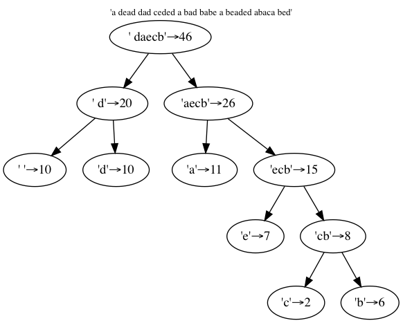
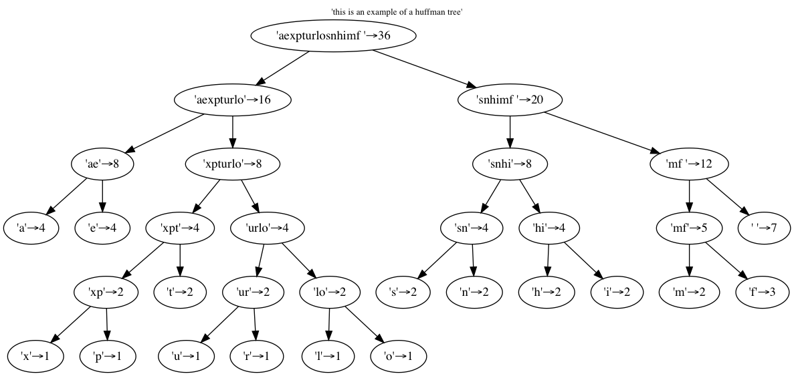

# Évaluation cours Python avancé

## Critères de correction

Le barême pour ce devoir est délibérément conçu pour vous inciter à faire **très
attention à la forme** autant qu'au fond; ainsi les points obtenus se
répartissent de la façon suivante :

* 50% seulement de la note sur **le fait que "ça marche"**, c'est-à-dire que les
  résultats obtenus correspondent bien à ce qui est demandé ;

* 20% de la note sur **la lisibilité du code**; vous êtes notamment invités à
  * suivre les recommandations de la PEP008, notamment en ce qui concerne la
    **place des espaces**, et la **largeur des pages** (ne pas dépasser 100
    caractères de large);
  * écrire des *doctrings* pour les classes et méthodes importantes;
  * insérer ni trop, ni trop peu de commentaires;
  * utiliser les *type hints* pour préciser le type des arguments lorsque vous
    pensez que ça peut clarifier l'usage de votre code

* 20% de la note pour la **simplicité** et la **concision** du code: plus votre
  code est simple et concis, plus il est facile à lire et à comprendre, et plus
  il sera facilement modifiable dans le futur; prenez soin de choisir les
  structures de données qui rendent les traitements aussi lisses que possible;
  n'hésitez pas à enlever les étapes inutiles, ou à récrire un morceau qui
  utilise une approche infructueuse;

* 10% de la note sur **le respect des consignes** en ce qui concerne les noms de
  fichiers, du repo git, etc… dont le non-respect ralentit la correction.

On recommande évidemment de lire l'énoncé jusqu'au bout avant de se lancer.

## Le sujet

On vous invite à implémenter l'algorithme dit du *codage de Hufmann*. On ne va
pas le décrire ici car il est abondamment décrit dans la littérature, mais en
deux mots il s'agit de
* partir de la fréquence d'apparition des caractères dans un certain langage,
* et d'en déduire un codage de chaque caractères sous la forme d'une suite
  de 0 et de 1
* avec la bonne propriété que les caractères **les plus fréquents** vont avoir un
  **codage plus court** que les caractères moins usités

de sorte que le texte encodé utilisera moins de place, le code se comporte
comme un compresseur.

---

On vous demande d'écrire deux commandes python, que l'on peut donc appeler
depuis le terminal:
* `hufmann-analyze.py` qui doit
  * lire un fichier dit de vocabulaire, typiquement un texte assez long et
    représentatif du langage,
  * l'utiliser pour élaborer un codage,
  * et sauver dans un fichier - on choisit pour fixer les idées de lui donner
    l'extension `.coder` - toutes les informations relatives à ce codage
* `hufmann.py` qui permet ensuite de
  * relire le fichier où on a sauvé le codage
  * et l'utiliser pour encoder ou décoder un contenu textuel ou binaire

---

Vous avez entièrement le choix de l'implémentation de tout ceci; notamment c'est
vous qui décidez
* du découpage de votre code en fichiers source (à part bien entendu les deux
  noms imposés pour les commandes)
* des structures de données les mieux appropriées pour réaliser la consigne
* le format et la manière dont l'encodage est sauvé sur le disque entre les deux
  étapes

---

Ce qui imposé par contre c'est la façon dont on peut appeler les deux commandes
(voir aussi les exemples un peu plus bas):

* `huffman-analyze.py`
  * attend un paramètre obligatoire, qui est le nom du fichier d'entrée (dans
    lequel on va compter les occurences de caractères)
  * avec l'option `-c` (ou `--coder`) on peut choisir dans quel fichier on va
    sauver l'encoder; si on ne la précise pas, on prendra pour ça le même nom
    que le fichier d'entrée, mais avec l'extension `.coder`

* `huffman.py`
  * attend un paramètre obligatoire, qui est le nom du fichier qu'on va encoder
    ou décoder
  * avec l'option `-d` (ou `--decode`) on indique qu'on veut décoder et non pas
    encoder
  * avec l'option `-o` (ou `--output`) on peut choisir dans quel fichier on va
    sauver le résultat (encodé ou décodé); si on ne la précise pas, on prendra:
    * pour l'encodage, le fichier d'entrée auquel au aura ajouté `.huf`
    * pour le décodage, le fichier d'entrée auquel on aura enlevé le `.huf`
  * avec l'option `-c` ou `--coder` on peut choisir l'encodage; par défaut on
    prendra `english.coder` 


## Artefacts

vous trouverez dans ce repo les fichiers suivants

* `selfcoded*.txt`  
  deux petits exemples de texte, a priori destinés à être encodés avec leur
  propre fréquence d'apparition, c'est comme cela que sont illustrés les exemples
  de la littérature
* `selfcoded*.ref`  
  le résultat attendu pour ces deux fichiers, pour vous permettre de valider
  votre résultat au moins sur ces deux entrées  
  *notez bien* que le résultat n'est pas forcément canonique, lorsque deux
  occurences se produisent avec la même fréquence; ce sont des choses dont on
  peut sans souci discuter par mail
* `english.txt` - [obtenu
  ici](https://archive.org/stream/TheultimateHitchhikersGuide/The%20Hitchhiker%27s%20Guide%20To%20The%20Galaxy_djvu.txt)  
  est le contenu d'un livre célèbre (la réponse est 42, mais quelle est la
  question ?), qu'on va utiliser comme étalon représentatif de la fréquence
  d'apparition des caractères, y compris de ponctuation et autres newline
* `sample*.txt`  
  d'autres exemples de texte, plutôt destinés à être encodés avec un coder issue
  de `english.txt`

## Exemples

### `selfcoded-01.txt`

Voici un exemple d'arbre de codage, obtenu avec la phrase la plus célèbre  
`a dead dad ceded a bad babe a beaded abaca bed`  
et en utilisant ce texte même pour élaborer l'encodage (c'est pour ça que
l'exemple s'appelle `selfcoded-01.txt`), on obtient l'arbre sauivant



et du coup l'encodage donne ceci (fourni dans le fichier `selfcoded-01.ref`)

```
1000011101001000110010011101100111001001000111110010011111011111100010001111110100111001001011111011101000111111001
```

Pour obtenir cet encodage on ferait donc
```bash
python huffman-analyze.py sample-01.txt
python huffman.py -c sample-01.coder sample-01.txt
```

### `selfcoded-02.txt`

Pour un second exemple (contenu dans `selfcoded-02.txt`) qui fait intervenir un
alphabet un peu plus vaste, on obtient cet arbre



et l'encodage

```
1011010001011010111010110101110000111111001110100000110100011101110011111000011001110001110100100111100110001100000111111101110010001001110110
```

### avec un vrai alphabet

pour illustrer de manière plus concrète l'utilisation des deux commandes, on
doit pouvoir faire

```
# en version longue:

# on analyse english.txt et on sauve le coder dans english.coder
python huffman-analyze.py --coder english.coder english.txt

# on utilise le coder de english.coder pour encoder sample-01.txt
# et ranger la version codée dans sample-01.txt.huf
python huffman.py --coder english.coder sample-01.txt -o sample-01.txt.huf

# on décode le .huf qu'on vient de faire, en rangeant
# le résultat dans sample-01.loop
python huffman.py --decode --coder english.coder sample-01.txt.huf -o sample-01.loop

# si tout est OK ceci ne doit rien afficher
# on compare, ces deux-là doivent être identiques
cmp sample-01.txt sample-01.loop
```

ou encore, en utilisant les options abrégées et les valeurs par défaut

```
# la même chose mais en version courte

# élaboration du codage
python huffman-analyze.py english.txt

# encodage
python huffman.py sample-01.txt

# décodage
python huffman.py -d -o sample-01.loop sample-01.txt.huf
cmp sample-01.txt sample-01.loop
```

(La dernière de ces commandes, `cmp`, est un utilitaire très simple qui compare
les deux fichiers et s'assure qu'ils sont identiques)

## Outils utiles

Je vous demande de vous limiter aux librairies qui font partie de [la librairie
standard Python](https://docs.python.org/3.10/library/); il est notamment
interdit d'utiliser une librairie qui ferait le gros du travail pour nous -
comme on en trouve par dizaines si on cherche `huffman` dans `pypi.org`. Ça
n'est pas vraiment l'esprit bien entendu (mais par contre ça peut le cas échéant
rendre service pour tester votre code).

Vous pourriez avoir envie d'utiliser les modules suivants, qui font tous partie
de la librairie standard

* `argparse` et notamment la classe `ArgumentParser` pour vérifier et analyser
  les paramètres et options passés sur la ligne de commande
* `collections` et notamment la classe `Counter`
* `pathlib` et notamment la classe `Path` pour les calculs sur les extensions de
  noms de fichier
* et peut-être aussi, quoique plus optionnel, le module `heapq` qui implémente
  de manière efficace une collection d'objets qui reste toujours triée lorsqu'on
  la manipule avec `heappush()` et `heappop()`

## Bonus: sortie en binaire

Pour les fichiers encodés, on a le choix:

* version de base: vous écrivez votre fichier encodés dans un fichier texte qui
  contient les caractères `0` ou `1`; c'est sous-optimal évidemment, avec cette
  aproche on n'a rien compressé du tout naturellement
* version avec bonus (+3 points possibles): vous écrivez votre fichier encodé
  dans un fichier binaire, qui permet d'occuper 8 fois moins de place environ,
  puisqu'on peut bien sûr ranger 8 bits dans chaque octet, au lieu de 1 seul bit
  par octet dans la première approche

Cette partie est relativement difficile, mais conseillée à ceux d'entre vous qui
sont arrivés en début d'année avec déjà un bon niveau en Python; même en
l'absence de résultat fonctionnel, n'hésitez pas à indiquer les voies envisagées
et les problèmes rencontrés.

## Modalités de rendu

Vous rendez votre devoir dans le repo dans votre espace github qui s'appelle
`ap-eval`, que vous créez comme privé et auquel vous invitez votre prof.

On doit pouvoir utiliser votre code directement après clonage, pensez à bien
mettre les fichiers de données dans votre repo également

La date limite sera précisée par mail

## Collaborations

Vous avez tout à fait le droit d'aller trouver de l'inspiration sur Internet, ou
de discuter entre vous de vos idées pour aborder le problème.

Par contre on vous demande un travail **personnel** et  j'insiste bien que
chacun doit **écrire son propre code** et non pas se contenter de paraphraser
vaguement un bout de code pompé tel quel, en comprenant juste vaguement ce que
ça fait. Vous devez être capable d'expliquer chaque étape, et le montrer dans
les commentaires; sachez qu'on repère très facilement ce type de plagiat, même
modulo un changement de noms de variables, que ce soit entre vous ou bien depuis
les articles que vous trouverez en deux clics sur Internet.
